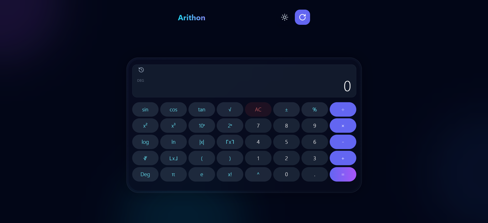

# 🔢 Arithon

<div align="center">


**A powerful, feature-rich scientific calculator built with React**

[](https://choosealicense.com/licenses/mit/)
[](https://reactjs.org/)
[](https://tailwindcss.com/)

[Features](#-features) • [Demo](#-demo) • [Installation](#-installation) • [Usage](#-usage) • [Documentation](#-documentation)

</div>

---

## 🌟 Overview

**Arithon** is a modern, full-featured scientific calculator that combines elegant design with powerful functionality. Built with React and Tailwind CSS, it offers precision calculations, advanced mathematical functions, and a responsive interface that works seamlessly across all devices.

### Why Arithon?

- ✨ **Complete Scientific Calculator** - All essential mathematical functions in one place
- 🎯 **Precision First** - Advanced floating-point handling and edge case management
- 🎨 **Beautiful UI** - Modern, clean design with dark/light theme support
- 📱 **Fully Responsive** - Optimized layouts for mobile, tablet, and desktop
- ⚡ **Lightning Fast** - Instant calculations with smooth animations
- 🔧 **Robust** - Comprehensive error handling and input validation

---

## ✨ Features

### 🧮 Mathematical Operations

#### Basic Operations
- ➕ Addition, ➖ Subtraction, ✖️ Multiplication, ➗ Division
- 🔢 Decimal support with precision handling
- ➕/➖ Sign toggle
- 📊 Percentage calculations
- 🔄 Parentheses with auto-closing

#### Scientific Functions
- **Trigonometry**: `sin`, `cos`, `tan` with degree/radian modes
- **Logarithms**: `log` (base 10), `ln` (natural log)
- **Powers**: `x²`, `x³`, `√`, `∛`, `x^y`
- **Exponentials**: `10^x`, `2^x`
- **Special Functions**: `x!` (factorial), `1/x`, `|x|`, `⌈x⌉`, `⌊x⌋`
- **Constants**: `π` (pi), `e` (Euler's number)

### 🎨 User Interface

- **Dual Themes**: Dark and light mode with smooth transitions
- **Responsive Layouts**: 
  - Portrait mode: Standard calculator layout
  - Landscape mode: Extended scientific calculator with all functions
- **Visual Feedback**: 
  - Angle mode indicator (DEG/RAD)
  - Button hover effects and animations
  - Error state highlighting
- **History**: Track your last 10 calculations
- **Copy to Clipboard**: One-click result copying

### 🛡️ Advanced Features

#### Precision & Error Handling
- ✅ Floating-point precision fixes (`0.1 + 0.2 = 0.3`)
- ✅ Automatic parentheses closing
- ✅ Large angle normalization (e.g., `sin(450°) = sin(90°)`)
- ✅ Factorial validation (integers only, 0-170)
- ✅ NaN detection → "Math Error"
- ✅ Infinity handling for division by zero and `tan(90°)`
- ✅ Very small number rounding (e.g., `sin(180°) = 0`)

#### Smart Behavior
- 🔒 Angle mode locking during calculations
- 🎯 Context-aware display formatting
- ⌨️ Keyboard support (coming soon)
- 📋 Calculation history with expression tracking

---

## 🎬 Demo

### Live Preview
> Add your deployment link here (Vercel, Netlify, GitHub Pages)

### Screenshots

<div align="center">

| Portrait Mode | Landscape Mode |
|:-------------:|:--------------:|
|  |  |

</div>

---

## � Installation

### Prerequisites

- **Node.js** (v14 or higher)
- **npm** (v6 or higher)

### Quick Start

```bash
# Clone the repository
git clone https://github.com/abhinavrathee/arithon.git

# Navigate to project directory
cd arithon

# Install dependencies
npm install

# Start development server
npm start
```

The app will open at `http://localhost:3000`

### Build for Production

```bash
# Create optimized production build
npm run build

# The build folder will contain the production-ready files
```

---

## 💻 Usage

### Basic Calculations

```
Example: 15 + 25 × 2
1. Enter: 15 + 25 × 2
2. Press: =
3. Result: 65
```

### Scientific Functions

```
Example: sin(90°)
1. Ensure "Deg" mode is active (check indicator)
2. Press: sin
3. Enter: 90
4. Press: )
5. Press: =
6. Result: 1
```

### Advanced Features

- **Switch Themes**: Click the theme toggle button (🌙/☀️)
- **View History**: Click the history button to see past calculations
- **Copy Result**: Click the copy icon when hovering over the display
- **Landscape Mode**: Rotate device or resize browser for extended functions

---

## 📂 Project Structure

```
Arithon/
├── public/
│   ├── favicon_io/          # App icons
│   ├── final.png            # Preview image
│   └── index.html           # HTML template
├── src/
│   ├── components/
│   │   └── Calculator.js    # Main calculator component
│   ├── App.js               # Root component
│   ├── index.js             # Entry point
│   ├── index.css            # Global styles
│   └── theme.js             # Theme configuration
├── .gitignore
├── package.json
├── tailwind.config.js
└── README.md
```

---

## 🧪 Testing

### Manual Testing Checklist

#### Basic Operations
- [ ] Addition, subtraction, multiplication, division
- [ ] Decimal calculations
- [ ] Parentheses handling
- [ ] Percentage calculations

#### Scientific Functions
- [ ] Trigonometric functions (deg/rad)
- [ ] Logarithms (log, ln)
- [ ] Powers and roots
- [ ] Factorial (0-170)
- [ ] Absolute value, ceil, floor

#### Edge Cases
- [ ] Division by zero → ∞
- [ ] sqrt(-1) → Math Error
- [ ] tan(90°) → ∞
- [ ] sin(180°) → 0
- [ ] 5.5! → Math Error
- [ ] Unclosed parentheses auto-close

---

## 📚 Documentation

### Function Reference

| Function | Symbol | Description | Example |
|----------|--------|-------------|---------|
| Square | x² | Square of x | 5² = 25 |
| Cube | x³ | Cube of x | 3³ = 27 |
| Square Root | √ | Square root | √16 = 4 |
| Cube Root | ∛ | Cube root | ∛27 = 3 |
| Power of 10 | 10ˣ | 10 to the power of x | 10² = 100 |
| Power of 2 | 2ˣ | 2 to the power of x | 2⁸ = 256 |
| Factorial | x! | Factorial (0-170) | 5! = 120 |
| Reciprocal | 1/x | 1 divided by x | 1/4 = 0.25 |
| Absolute | \|x\| | Absolute value | \|-5\| = 5 |
| Ceiling | ⌈x⌉ | Round up | ⌈3.2⌉ = 4 |
| Floor | ⌊x⌋ | Round down | ⌊3.9⌋ = 3 |
| Sine | sin | Sine (deg/rad) | sin(90°) = 1 |
| Cosine | cos | Cosine (deg/rad) | cos(0°) = 1 |
| Tangent | tan | Tangent (deg/rad) | tan(45°) = 1 |
| Log | log | Base 10 logarithm | log(100) = 2 |
| Natural Log | ln | Natural logarithm | ln(e) = 1 |
| Pi | π | Pi constant | π ≈ 3.14159 |
| Euler | e | Euler's number | e ≈ 2.71828 |

### Keyboard Shortcuts (Coming Soon)

| Key | Action |
|-----|--------|
| 0-9 | Number input |
| +, -, *, / | Operations |
| Enter | Calculate |
| Escape | Clear |
| Backspace | Delete last |

---

## 🛠️ Technologies Used

- **[React](https://reactjs.org/)** - UI framework
- **[Tailwind CSS](https://tailwindcss.com/)** - Styling
- **[Lucide React](https://lucide.dev/)** - Icons
- **[React Responsive](https://www.npmjs.com/package/react-responsive)** - Media queries

---

## 🤝 Contributing

Contributions are welcome! Here's how you can help:

1. Fork the repository
2. Create a feature branch (`git checkout -b feature/AmazingFeature`)
3. Commit your changes (`git commit -m 'Add some AmazingFeature'`)
4. Push to the branch (`git push origin feature/AmazingFeature`)
5. Open a Pull Request

### Ideas for Contributions

- [ ] Keyboard shortcuts implementation
- [ ] Additional scientific functions (sinh, cosh, tanh)
- [ ] Unit conversion features
- [ ] Calculation export/import
- [ ] More themes
- [ ] Accessibility improvements

---

## � Known Issues

- Memory functions (MC, MR, M+, M-) removed in landscape mode to accommodate new functions
- Very large factorial calculations (>170) return infinity due to JavaScript limitations

---

## 📝 Changelog

### Version 2.0.0 (Current)
- ✅ Added 10^x, 2^x, |x|, ⌈x⌉, ⌊x⌋ functions
- ✅ Implemented comprehensive edge case handling
- ✅ Added angle normalization (modulo 360)
- ✅ Improved precision for trigonometric functions
- ✅ Added visual angle mode indicator
- ✅ Implemented angle mode locking during calculations
- ✅ Auto-closing parentheses
- ✅ Enhanced error messages

### Version 1.0.0
- ✅ Basic calculator operations
- ✅ Scientific functions (sin, cos, tan, log, ln)
- ✅ Dark/light theme
- ✅ Responsive design
- ✅ Calculation history

---

## 📄 License

This project is licensed under the **MIT License** - see the [LICENSE](./LICENSE) file for details.

---

## 👨‍💻 Author

**Abhinav Rathee**

- GitHub: [@abhinavrathee](https://github.com/abhinavrathee)

---

## 🙏 Acknowledgments

- Inspired by the Microsoft Calculator
- Icons by [Lucide](https://lucide.dev/)
- Built with ❤️ using React and Tailwind CSS

---

<div align="center">

**⭐ Star this repo if you find it helpful!**

Made with ❤️ by [Abhinav Rathee](https://github.com/abhinavrathee)

</div>
